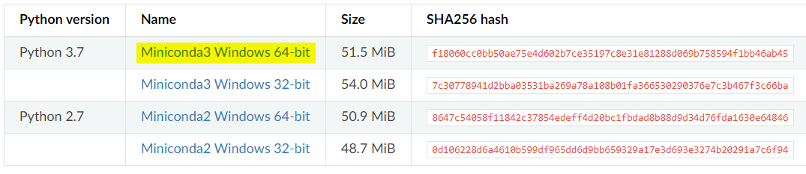
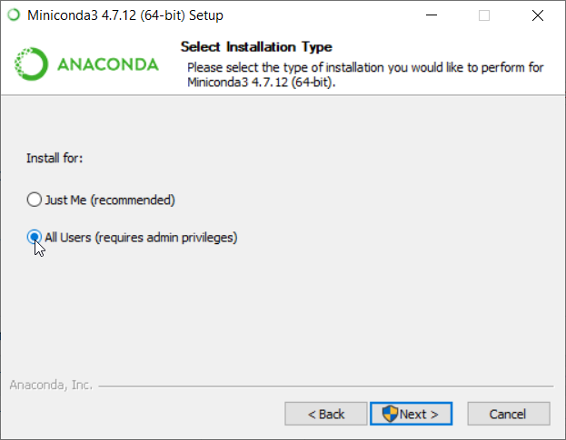
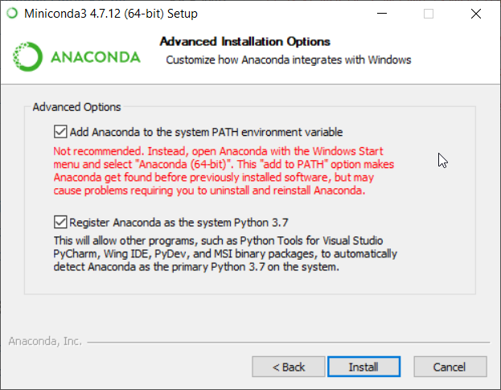
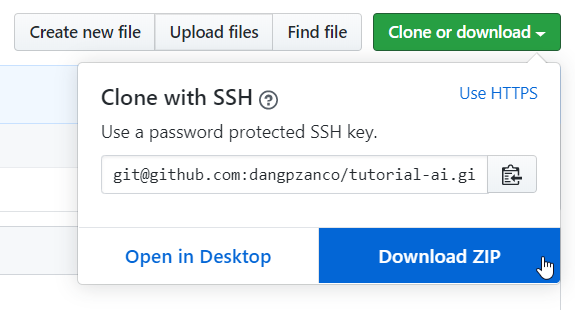

## Códigos exemplos para o treinamento de Inteligência Artificial

1. `teste_basico.ipynb` - Algumas operações básicas em Python.
   Dataset: `diabetes.csv`
2. `tensorflow_keras_mnist.ipynb` - Reconhecimento de caracteres (MNIST) utilizando TensorFlow e redes neurais convolucionais (CNN).
   Dataset: MNIST
3. `Diabetes_Model.ipynb` - Modelo com regressão logística para prever riscos de diabetes.
   Dataset: `diabetes.csv`
4. `doenca_renal.ipynb` - Modelo com rede neural para prever riscos de doença renal.
   Dataset: `kidney_disease.csv`
5. `Heart_Disease_LR.ipynb` - Modelo com regressão logística para prever riscos de doença cardíaca em um intervalo de 10 anos.
    Dataset: `framingham.csv`


## Bibliotecas utilizadas

Versão do Python: 3.7

- Tensorflow (Keras)
- Pandas
- Numpy
- Matplotlib
- Seaborn
- Scikit-Learn
- Jupyter


## Instalação (Windows)

Instalar o [Miniconda3](https://docs.conda.io/en/latest/miniconda.html), versão Python 3.7:



Durante a instalação, marcar a opção:

- [x] `All Users (requires admin privileges)` 



Também marcar as opções:

- [x] `Add Anaconda to the system PATH environment variable` 
- [x] `Register Anaconda as the system Python 3.7`



Instalar os pacotes necessários, via linha de comando (`cmd.exe`) e com permissões de administrador:

```
conda install jupyterlab matplotlib pandas scikit-learn seaborn tensorflow git
```

Clonar o [repositório](https://github.com/dangpzanco/tutorial-ai) que contém os scripts:

```
git clone https://github.com/dangpzanco/tutorial-ai
```

Ou baixar e extrair os arquivos:



Mudar de diretório para o local onde este documento se encontra e iniciar o `jupyter` para ter acesso aos scripts:

```
C:\> cd tutorial-ai
C:\tutorial-ai\> jupyter notebook
```

